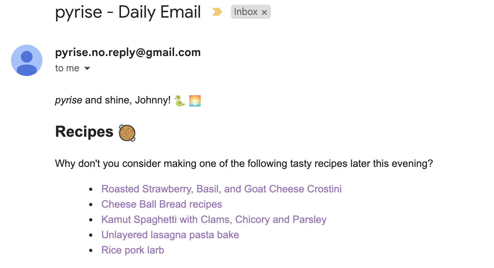

# `pyrise` - A Daily Newsletter Service :sunrise:

## Introduction

A minimalist personal newsletter service :relaxed:

`pyrise` sends me a scheduled email every morning at 9am (GMT) with the following information,

- Recipes to try out when the evening comes along! :bento: :pizza:
- A 'stoic' quote of the day

There is scope to add (a lot!) more to this service in the future.

Here is a sample screenshot:

    

## Deployment

This service is deployed to AWS,

* The email handler is deployed to Lambda
* Access tokens are parsed via S3
* EventBridge is used to invoke the service on a scheduled basis

To deploy to AWS you need to configure your AWS credentials locally (via SSO or o/w) and then 
run the deployment script listed at: `./aws/setup.sh`

Equivalent teardown of infrastructure can be completed by running: `./aws/teardown.sh`
