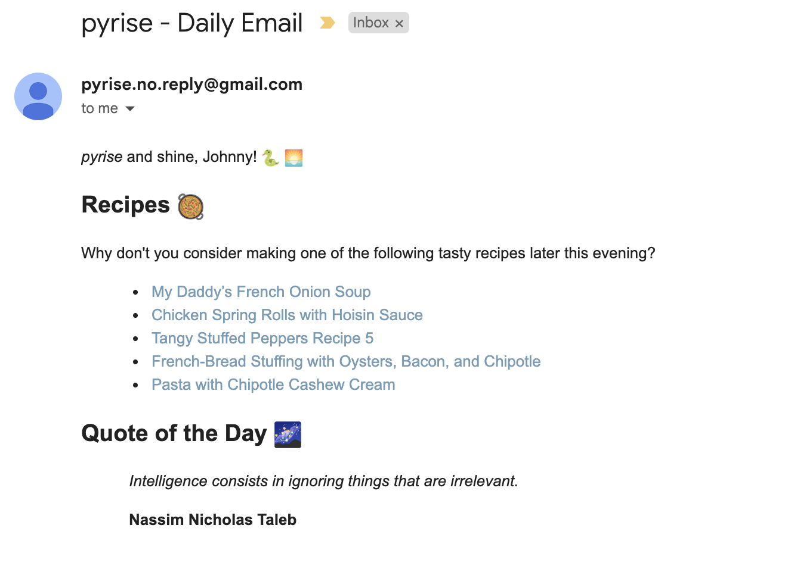

# `pyrise` - A Daily Planning Service :sunrise:

## Introduction

A minimalist personal assistant that helps me to plan my day :relaxed:

`pyrise` sends me a scheduled email every morning at 6:30am (GMT) with the following information,

- Recipes to try out when the evening comes along! :bento: :pizza:

Here is a sample:

## Deployment

The email service is deployed to AWS. 

The email handler is deployed to Lambda - required tokens are parsed via S3 and CloudWatch 
is used to invoke the service on a scheduled basis.

## Future Development

In the future, the following items will be added to the service:

- Weather expectations for the day :rainbow: :cyclone:
- Pollen expectations for the day (I suffer from hayfever so this is useful!) :honeybee:
- Poem of the day :books:
- Fitness metrics exposed by Strava - progress 'this week' and further progress to be made! :running:

